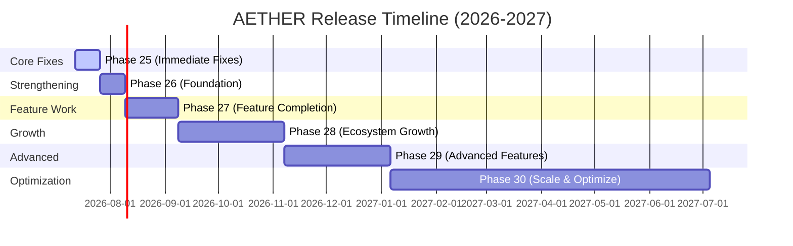

# AETHER Strategic Roadmap

This document outlines the development plan for Project AETHER from v1.0.0 onwards.

---

## 📅 Roadmap Overview

---

## 🚀 Phase Deliverables

### Phase 25: Critical Fixes (Week 1-2)
- **Immediate Focus**: Integrate line/column spans in compiler error reports. Add basic panic handling.
- **Deliverables**: Updated parsing errors with offset tokens.

### Phase 26: Foundation Strengthening (Week 3-4)
- **Immediate Focus**: Parallelize JIT compiler evaluations using multi-threaded execution pools.
- **Deliverables**: Thread-safe UCG (Unified Context Graph) allocations.

### Phase 27: Feature Completion (Month 2)
- **Immediate Focus**: Qiskit/OpenQASM bridge implementation for physical QPU backend routing.
- **Deliverables**: Native gate output formatting to OpenQASM files.

### Phase 28: Ecosystem Growth (Month 3-4)
- **Immediate Focus**: Expand `libraries/std/` to include formal HTTP server implementations and SQLite bindings.
- **Deliverables**: `std/http.aether` and `std/db.aether` files.

### Phase 29: Advanced Features (Month 5-6)
- **Immediate Focus**: Real EEG device SDK bindings (e.g. OpenBCI headset streams).
- **Deliverables**: Dynamic library loading for hardware communication.

### Phase 30: Scale & Optimize (Month 7-12)
- **Immediate Focus**: Build a self-hosting AETHER compiler that compiles itself down to target system assembly files without depending on Cargo/Rust.
- **Deliverables**: Native machine code output compiler backends.
